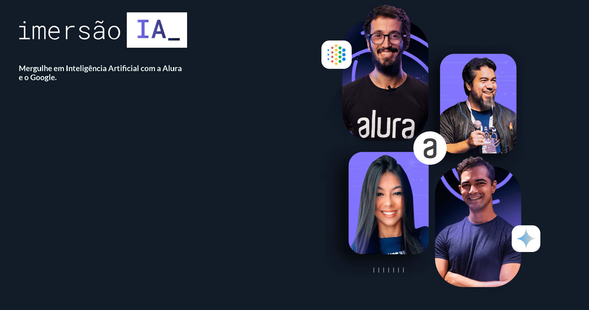

# Imersão Inteligência Artificial ALURA

No Imersão de Inteligência Artificial feita pela Alura em maio de 2024 em parceria com o Google foram abordados os seguintes assuntos:

- Utilização da IA generativa GEMINI
- Técnicas de criação de prompt
- Integração com o Python
- Vetorização de conteúdo
- Busca semântica em conteúdo vetorizado e integração com IA generativa.

Neste repositório estão disponíveis os materiais de estudos da imersão.
